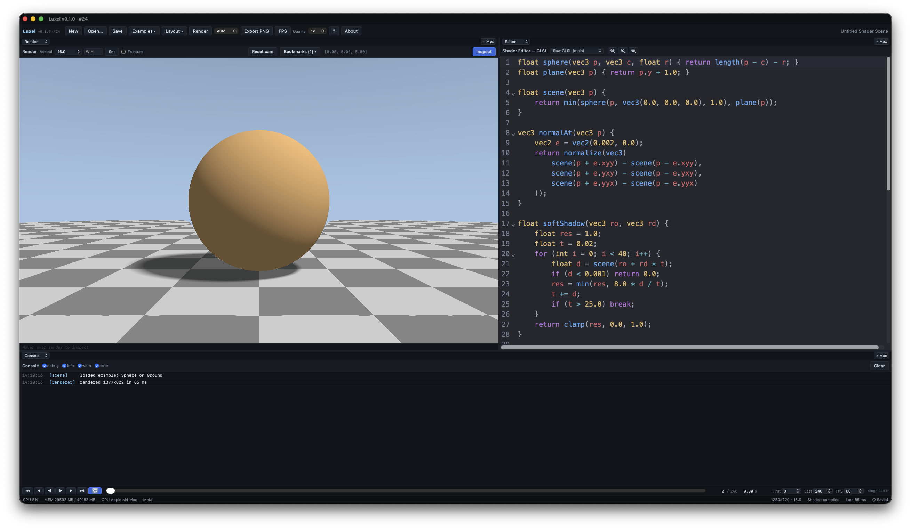

# Luxel

A local, developer-focused GLSL shader workbench: edit Shadertoy-style GLSL fragment shaders, render in real time, and inspect the result with camera tools, a pixel inspector, an interactive GLSL scratchpad, a debug console, and status monitoring.



## Current Status

Milestone 0 through 6 scaffolding is in place:

- Tauri 2 + React/TypeScript + Vite frontend.
- Rust workspace with `luxel-core`, `luxel-io`, `luxel-system`, `luxel-render`.
- `wgpu`-based offscreen renderer with `naga` GLSL-to-WGSL translation.
- Shadertoy-compatible `mainImage(out vec4, in vec2)` entry point with `iResolution`, `iTime`, `iFrame`, `iMouse` uniforms.
- Scene file format (`.luxel.json`) with `schemaVersion` and migration scaffolding.
- Camera orbit/pan/dolly/reset, bookmarks, frustum overlay, aspect-ratio control.
- Auto/manual render toggle with `requestAnimationFrame` render driver.
- Pixel inspector (footer bar + dedicated Inspector panel) with a pinnable pixel and an on-canvas crosshair.
- Interactive GLSL Scratchpad: evaluate expressions at a chosen pixel, with reusable variables, a built-in catalog, and Tab autocomplete.
- Timeline playback with loop support.
- Unified per-view font zoom that targets the panel under the cursor.
- Cross-platform Python helper scripts.

## Requirements

- Python 3.11+ (for the helper scripts)
- Rust toolchain (stable, via [rustup](https://rustup.rs))
- Node.js 18+ with npm
- macOS Apple Silicon (Metal) or Windows with a DX12/Vulkan capable GPU

Run `python scripts/doctor.py` to verify your environment.

## macOS setup

```bash
xcode-select --install
brew install node       # if you don't already have it
curl https://sh.rustup.rs -sSf | sh
python scripts/doctor.py
```

## Windows setup

1. Install [Visual Studio Build Tools 2022](https://visualstudio.microsoft.com/visual-cpp-build-tools/) with the "Desktop development with C++" workload.
2. Install [Node.js LTS](https://nodejs.org).
3. Install Rust via [rustup](https://rustup.rs).
4. Run `python scripts/doctor.py`.

## Run the dev app

```bash
python scripts/launch.py
python scripts/launch.py --scene examples/default_scene.luxel.json
python scripts/launch.py --gpu-backend metal     # macOS
python scripts/launch.py --gpu-backend dx12      # Windows
python scripts/launch.py --gpu-backend vulkan
```

## Run the tests

```bash
python scripts/test.py
python scripts/test.py --rust-only
python scripts/test.py --frontend-only
python scripts/test.py --lint
```

## Build a release

```bash
python scripts/build.py --release
# or, identically:
python scripts/package.py --release
```

`--release` runs `tauri build`, which produces shippable platform bundles:

| Platform | Output |
| --- | --- |
| macOS | `target/release/bundle/macos/Luxel.app` (the app itself) + `target/release/bundle/dmg/Luxel_*.dmg` (installer for sharing) |
| Windows | `target/release/bundle/msi/Luxel_*.msi` + `target/release/bundle/nsis/Luxel_*-setup.exe` |

A debug build (`python scripts/build.py` with no flags) just produces `dist/` and `target/debug/luxel-app` - useful for `./target/debug/luxel-app` development runs but not packaged for sharing.

## Camera controls

Luxel's camera is a "look-at" rig: a `position`, `target`, and `up` vector with a vertical FOV. The Render view exposes it through these gestures (inside the render canvas):

| Input | What it does |
| --- | --- |
| Left-drag | Orbit around `target`, distance preserved |
| Shift-drag or middle-drag | Pan (both `position` and `target` slide together) |
| Scroll wheel | Dolly: move along the camera-to-target ray, can't cross the target |
| `F` | Reset to default `(0, 0, 5)` looking at the origin |
| **Reset cam** button | Same as `F` |
| **Bookmarks** | Save the current camera, restore a saved one, or delete |
| Camera position readout | Top-right of the Render header shows `[x, y, z]` |

The camera is exposed to GLSL shaders through these uniforms:

```glsl
vec3  iCameraPosition    // world-space position
float iCameraFov         // vertical, radians
vec3  iCameraForward     // unit basis vector pointing into the scene
vec3  iCameraRight       // unit basis vector
vec3  iCameraUp          // unit basis vector
```

The canonical ray-direction formula for a raymarcher:

```glsl
vec2 uv = (fragCoord * 2.0 - iResolution.xy) / iResolution.y;
float h = tan(iCameraFov * 0.5);
vec3 rd = normalize(iCameraForward + uv.x * h * iCameraRight + uv.y * h * iCameraUp);
```

Press `?` in the toolbar for an in-app quick reference covering keyboard shortcuts and the full uniform list.

The toolbar's **FPS** button toggles a heads-up overlay in the top-left of the render view that reports rolling FPS, last frame time (ms), and the current render resolution. The setting persists across app restarts via `localStorage`.

## Rendering

### Render driver

Luxel uses a single `requestAnimationFrame` loop ([`src/hooks/useRenderDriver.ts`](src/hooks/useRenderDriver.ts)) - same model as a DCC viewport. Each animation frame:

1. Checks whether the scene is "dirty" (camera, render size, iTime, iFrame, or render quality changed since the last render).
2. If dirty AND no render is in flight, kicks off a GPU render at the current preview resolution.
3. Serializes renders - at most one in flight at a time, so a slow shader naturally caps the loop's rate without manual throttling.

End-to-end latency from a drag event to a rendered frame is one animation frame (~16 ms at 60 Hz). The result: navigation feels native.

When the scene is idle (no inputs changing), the loop still ticks but does no GPU work.

### Auto / manual mode

The toolbar has an **Auto/Manual** dropdown next to the Render button. In Auto mode (the default), the render driver fires on every change. In Manual mode, rendering only happens when you click **Render** or press `Cmd/Ctrl+Enter`. Useful when working on a large shader and you want to avoid taxing the GPU until the code is ready to test.

### Timeline and playback

`iTime` and `iFrame` are exposed as manual scrub controls in the playback bar at the bottom. The bar includes transport buttons (first, step back, play backward, play forward, step forward, last) and a loop toggle. When loop is enabled, playback wraps from last frame to first (or first to last when playing in reverse) instead of stopping at the timeline bounds.

## Pixel inspector

Toggle **Inspect** in the Render view header to show a footer bar under the canvas with live readouts of the pixel under the cursor: pixel coordinates (bottom-left origin, matching `gl_FragCoord`), render resolution, UV, and RGB values with a color swatch. Inspect is off by default and is a per-session toggle.

The **Inspector** panel (available in the slot dropdown) shows the same pixel data along with uniforms, camera state, and render statistics.

### Pinning a pixel

The Inspector's **Pin (x, y)** field locks the readout to a specific pixel, so it stays populated even with interactive Inspect off, and even when the cursor leaves the canvas. This is handy for teaching ("we're looking at pixel 40, 100"). The **Crosshair** toggle in the Render header marks that pixel on the canvas. The pinned pixel is in bottom-left / `gl_FragCoord` space and is shared with the Scratchpad. If a resize puts the pixel outside the current render, the readout says so and the crosshair hides until it's back in range.

### Font zoom

Editor, Inspector, Console, and Scratchpad text scale with one hotkey, `Cmd/Ctrl` + `+`/`-`/`0`, applied to whichever panel the cursor is over. The editor also has explicit zoom buttons in its header.

## Scratchpad

The **Scratchpad** view is a REPL for GLSL expressions: type an expression and see its value at the pinned pixel. It's the GLSL answer to print-debugging, useful for learning what built-ins and vector math actually do.

Every scene uniform (`iResolution`, `iTime`, the camera uniforms, ...) and `gl_FragCoord` are in scope, prefilled from the current scene; `iTime` and the pixel are overridable in the Scratchpad header. Expressions are evaluated through the real `naga`/`wgpu` path (rendered to a 1-pixel float target), so results match the live shader exactly.

```glsl
> length(vec2(3.0, 4.0))
5
float
> (gl_FragCoord.xy - 0.5 * iResolution.xy) / iResolution.y
vec2(-0.5, -0.0833)
vec2
```

| Action | What it does |
| --- | --- |
| `name = <expr>` | Snapshot a value and reuse it on later lines |
| `Tab` | Autocomplete built-ins, uniforms, variables, and swizzles (after a vector `.`) |
| `↑` / `↓` | Move the suggestion list, or walk expression history |
| `:builtins` | List the available functions and uniforms |
| `:help <name>` | Show a built-in's signature (e.g. `:help mix`) |
| `:vars` / `:reset` | List or clear your variables |
| `:clear` | Clear the scrollback |

Color-like results (a `vec3`/`vec4` in `[0, 1]`) show a swatch. A built-in called with the wrong arguments reports its real signature instead of a generic "unknown function" error.

## Performance notes

Dev builds are noticeably slower than release because `wgpu`, `naga`, and the Tauri shell run unoptimized debug code on a hot path (every camera drag triggers a render). Two ways to speed them up:

1. **The `[profile.dev]` tweak already applied** to `Cargo.toml` keeps Luxel's own crates fast to recompile but compiles every dependency at `opt-level = 3`. First build of new deps takes ~30s longer, then each subsequent dev run is much snappier. You don't need to do anything; just run `python scripts/launch.py` as usual.
2. **Render-quality multiplier** in the toolbar lets you scale the preview render down (1/4x to 2x). On a heavy raymarcher or a slow GPU, dropping to 1/2x makes camera drags feel native; you can bump it back to 1x before exporting.

For maximum performance, run the release build:

```bash
python scripts/build.py --release
# then open the bundled binary from src-tauri/target/release/
```

The release build is typically 5-10x faster than the dev build for shader-heavy scenes.

## Open / save scenes

- Use the **Open...** button in the toolbar to load a `.luxel.json` file.
- Use **Save** to write the current scene; an unsaved scene prompts for a path.
- Scenes embed: GLSL source, render settings (resolution, aspect ratio, overlay), camera state, camera bookmarks, and panel layout.

## Window state

Luxel remembers its window size, position, and maximized/fullscreen state between launches via [`tauri-plugin-window-state`](https://github.com/tauri-apps/plugins-workspace/tree/v2/plugins/window-state). State is written on exit and restored on startup; no per-scene configuration is involved. To reset to defaults, delete the plugin's state file (`.window-state.json` under the app's data directory).

## Known limitations (v1)

- Single-frame rendering only (no animation loop).
- Fragment shader only; no compute, no multipass buffers, no texture channels.
- GLSL is translated to WGSL via `naga`; some advanced GLSL features may not survive translation. Errors include line numbers mapped back to the user's source.
- NVIDIA support means DX12 or Vulkan, **not** CUDA.

## Architecture

```
luxel/
├── Cargo.toml                  # Rust workspace
├── package.json                # Frontend deps (Vite + React + TS)
├── src-tauri/                  # Tauri shell (Rust process)
│   └── src/
│       ├── lib.rs              # Entrypoint, plugin setup
│       ├── commands.rs         # #[tauri::command] surface
│       ├── app_state.rs        # AppState (renderer, sampler)
│       └── events.rs           # Console event emission
├── crates/
│   ├── luxel-core/             # Scene model, camera math, validation
│   ├── luxel-io/               # Scene JSON load/save + migrations
│   ├── luxel-system/           # CPU/memory/GPU sampling
│   └── luxel-render/           # wgpu pipeline, GLSL prelude, naga compile, expression eval
├── src/                        # React frontend
│   ├── components/             # LayoutRoot, RenderView, ShaderEditor, ConsolePanel, InspectorPanel, Scratchpad, ...
│   ├── glsl/                   # Built-in catalog for Scratchpad help/autocomplete
│   ├── state/                  # Zustand stores (scene, console, app)
│   └── tauri/                  # invoke() and event subscription wrappers
├── scripts/                    # Python build/test/launch helpers
└── examples/                   # Default scene + GLSL fixtures
```

### Tauri command surface

- `load_scene(path) -> SceneFile`
- `save_scene(path, scene)`
- `validate_scene_cmd(scene)`
- `default_scene() -> SceneFile`
- `compile_shader(shader) -> ShaderCompileResult`
- `render_single_frame(scene) -> RenderResult`
- `eval_glsl(scene, expr, preamble, resolution, pixel, ...) -> EvalResult`
- `get_system_status() -> SystemStatus`
- `get_gpu_info() -> GpuInfo`
- `set_gpu_backend(backend)`

Console messages are emitted on the `luxel://console` event channel.

## License

MIT. See [LICENSE](LICENSE) for details.
